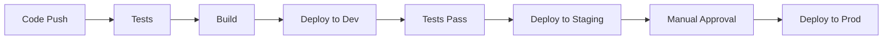

# 🔗 LinkHub - Modern Link-in-Bio Platform

<div align="center">

[](https://github.com/RectiFlex/link-bio-app/actions/workflows/deploy.yml)
[](https://github.com/RectiFlex/link-bio-app/actions/workflows/test.yml)
[](https://opensource.org/licenses/MIT)

</div>

## 📖 Overview

LinkHub is a powerful, modern link-in-bio platform built with Node.js and deployed on Tencent Kubernetes Engine (TKE). Create stunning, customizable link pages with analytics, QR codes, and more.

## ✨ Features

- 🎨 Customizable themes and layouts
- 📊 Advanced analytics and tracking
- 🔒 Secure authentication and authorization
- 📱 Mobile-responsive design
- 🌍 Multi-language support
- 🔄 Real-time statistics
- 📷 Image and media hosting
- 🔗 QR code generation
- 📈 Performance monitoring

## 🚀 Quick Start

### Prerequisites

- Node.js >= 16
- Docker
- kubectl
- Tencent Cloud account
- MongoDB

### Local Development

```bash
# Clone the repository
git clone https://github.com/yourusername/linkhub.git

# Install dependencies
cd linkhub
npm install

# Set up environment variables
cp .env.example .env

# Start development server
npm run dev
```

### 🐳 Docker Deployment

```bash
# Build Docker image
docker build -t linkhub-api .

# Run container
docker run -p 3000:3000 linkhub-api
```

## 🌟 Kubernetes Deployment

### TKE Setup

```bash
# Apply Kubernetes configurations
kubectl apply -k k8s/overlays/prod

# Verify deployment
kubectl get pods -n linkhub-prod
```

### Environment Configuration

```bash
# Create namespace
kubectl create namespace linkhub-prod

# Create secrets
kubectl create secret generic linkhub-secrets \
  --from-literal=JWT_SECRET=your-jwt-secret \
  --from-literal=AWS_ACCESS_KEY=your-aws-key \
  --from-literal=AWS_SECRET_KEY=your-aws-secret \
  -n linkhub-prod
```

## 🏗️ Project Structure

```
linkhub/
├── 📁 src/
│   ├── 📁 config/
│   ├── 📁 controllers/
│   ├── 📁 middleware/
│   ├── 📁 models/
│   ├── 📁 routes/
│   └── 📁 utils/
├── 📁 k8s/
│   ├── 📁 base/
│   └── 📁 overlays/
├── 📁 tests/
└── 📄 README.md
```

## 🧪 Testing

```bash
# Run all tests
npm test

# Run specific tests
npm test tests/integration/profile.test.js

# Run tests with coverage
npm run test:coverage
```

## 📊 Monitoring & Analytics

- 📈 Prometheus metrics
- 📊 Grafana dashboards
- 🔍 Error tracking
- ⚡ Performance monitoring

## 🔐 Security Features

- 🔒 JWT Authentication
- 🛡️ Rate limiting
- 🔑 Role-based access control
- 🔐 TLS encryption
- 🛑 XSS protection

## 🚀 CI/CD Pipeline



## 📱 API Endpoints

### Authentication
- 🔑 POST `/api/auth/signup`
- 🔑 POST `/api/auth/login`
- 🔑 POST `/api/auth/forgot-password`

### Profile
- 👤 GET `/api/profile`
- 👤 PATCH `/api/profile`
- 📸 POST `/api/profile/image`

### Links
- 🔗 GET `/api/links`
- 🔗 POST `/api/links`
- 🔗 PATCH `/api/links/:id`
- 🔗 DELETE `/api/links/:id`

### Analytics
- 📊 GET `/api/analytics/dashboard`
- 📊 GET `/api/analytics/links/:linkId`

## 🛠️ Environment Variables

```env
NODE_ENV=production
PORT=3000
MONGODB_URI=mongodb://localhost:27017/linkhub
JWT_SECRET=your-secret-key
AWS_ACCESS_KEY=your-access-key
AWS_SECRET_KEY=your-secret-key
```

## 🤝 Contributing

1. Fork the repository
2. Create your feature branch (`git checkout -b feature/AmazingFeature`)
3. Commit your changes (`git commit -m 'Add some AmazingFeature'`)
4. Push to the branch (`git push origin feature/AmazingFeature`)
5. Open a Pull Request

## 📄 License

This project is licensed under the MIT License - see the [LICENSE](LICENSE) file for details.

## 📞 Support

- 📧 Email: support@linkhub.example.com
- 💬 Discord: [Join our server](https://discord.gg/linkhub)
- 📝 Issues: [GitHub Issues](https://github.com/yourusername/linkhub/issues)

## 🙏 Acknowledgments

- Tencent Cloud for TKE
- MongoDB Team
- Node.js Community
- All contributors

---

Made with ❤️ by Your Team
